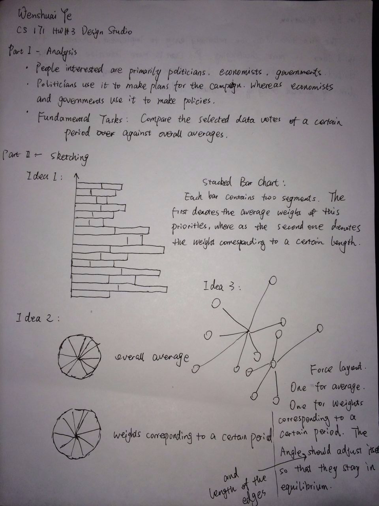
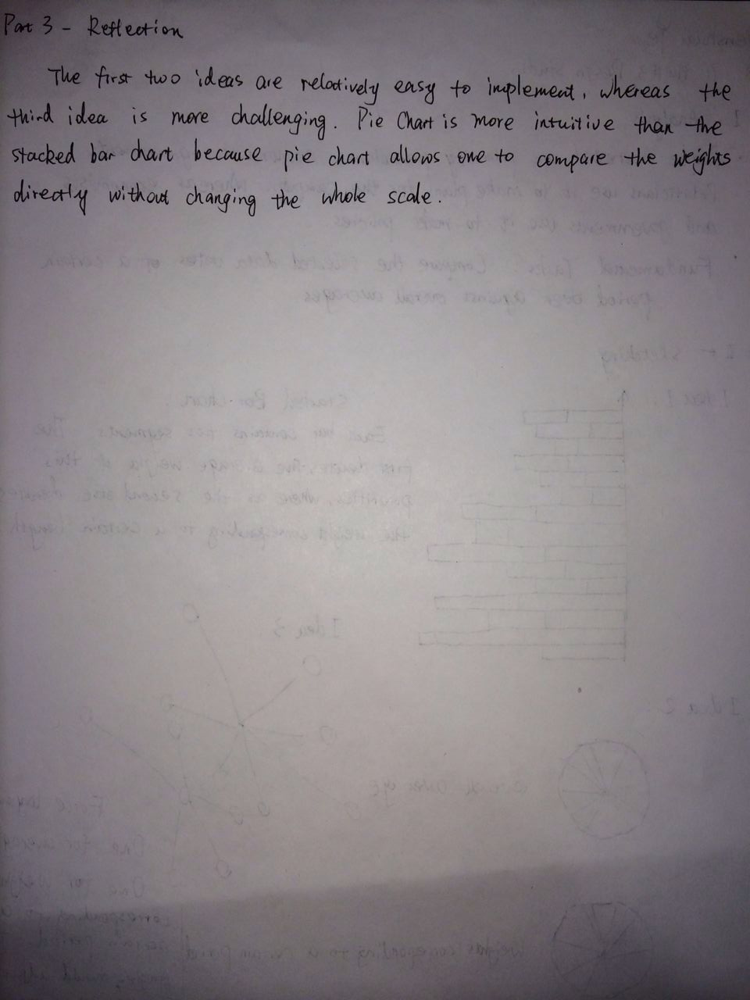
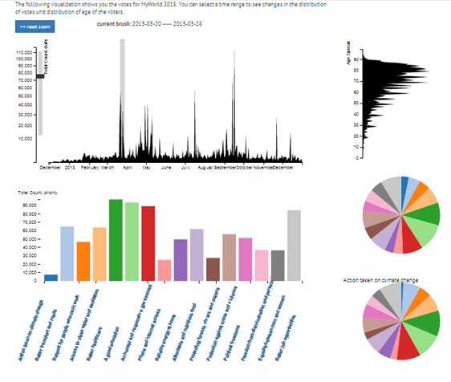
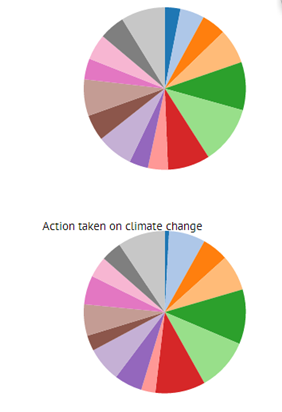
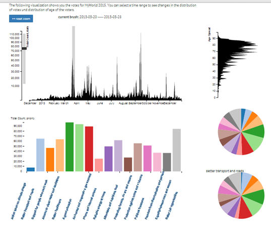
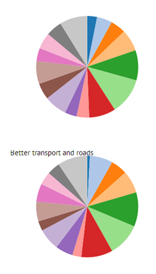

Wenshuai Ye
CS 171 HW#3
# Answers for Questions

### Q5a
**Question:** Choose __one__ comparison scenario and create at least three alternative designs that would allow this comparison.

-
**Answer:**

- put your sketches in folder [designStudio/](designStudio/)
###Sketches

- add any additional comments here
Most of the comments can be found along with the sketches. In case that my handwriting is hard to read, I make a printed version below. The scenario we use is to compare the selected data votes of a certain period against overall averages.
design 1: Stacked Bar Chart
	--- Each bar contains two segments. The first denotes the average weight of this priorities, whereas the second one denotes the weight corresponding to a certain length.
degisn 2: Pie Chart
	--- Two pie charts are sketched. One denotes the overall average weights. The other denotes the weights corresponding to a certain period.
design 3: Force Layout
	--- Two force layouts are sketched. One is for the average weights, whereas the other corresponds to the weights in a certain period. The angle and length of the edges should adjust themselves so that they stay in equilibrium.

### Q5b
**Question:** Implement one design in your visualization for **PrioVis** and explain why you have chosen this design.

-
**Answer:**

- your reasoning goes here.
Among the three designs, "Stacked Bart Chart" and "Pie Chart" are relatively easier to implement, whereas "Force Layout" is more challenging. Pie Chart is more intuitive than the stacked bar chart because pie chart allows us to compare the weights directly without changing the scale. As a result, I implemented the pie chart version.

### Q5c
**Question:** As a very minimal case study submit a screenshot of an interesting pattern which you have found with your method and briefly describe the pattern.

-
**Answer:**

- your description goes here
From the screen shot, we can find that in late March of 2013, people paid less attention to the priority of "Action taken on Climate Change" than the overall average. During this short period, they tend to shift their focus to the priority that addresses "Better Transport and Roads". 

### Screenshots

